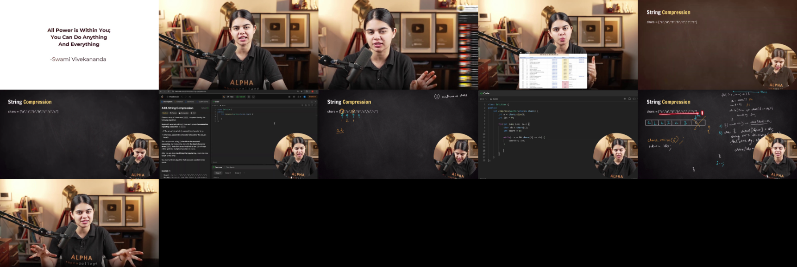
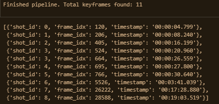
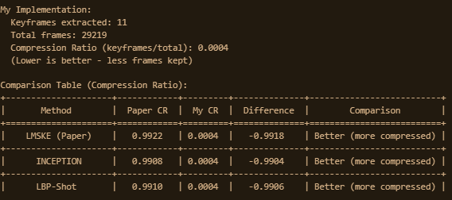

# LMSKE: Long-Term Multi-shot Keyframe Extraction

## Overview

This project implements an automated video summarization framework that extracts representative keyframes from videos using scene detection and semantic feature analysis.

The proposed LMSKE pipeline combines scene segmentation, CLIP-based feature extraction, clustering, and redundancy filtering to generate a concise visual summary while preserving important content from the original video.

---

## Pipeline


The framework consists of the following stages:

1. Video Input
2. Scene Detection using PySceneDetect
3. Frame Sampling
4. CLIP Feature Extraction
5. K-Means Clustering
6. Representative Keyframe Selection
7. Redundancy Removal
8. Summary Generation

---

## Technologies Used

* Python
* OpenCV
* PyTorch
* CLIP (ViT-B/32)
* Scikit-learn
* PySceneDetect
* NumPy
* Matplotlib

---

## Sample Output

### Extracted Keyframes



### Extracted Keyframe Timestamps



### Performance Evaluation



---

## Outputs

The framework generates:

* Representative keyframes
* Keyframe timestamps
* Keyframe visualization grid
* Compression ratio analysis
* Performance comparison metrics

---

## Repository Structure

```text
.
├── LMSKE_Project.ipynb
├── README.md
├── requirements.txt
├── images/
│   └── pipeline.png
└── sample_output/
    ├── keyframes_grid.png
    ├── keyframe_timestamps.png
    └── performance_metrics.png
```

---

## Future Work

* Real-time video summarization
* Multi-modal video understanding
* Video caption generation
* Transformer-based shot understanding
* Adaptive keyframe selection strategies

---

## Author

Zaed Rizwan
